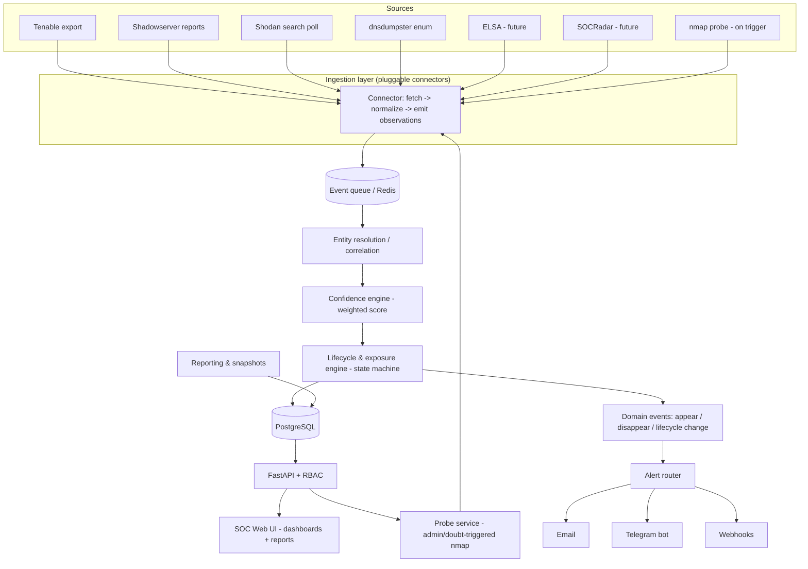
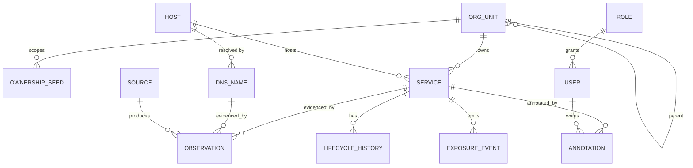
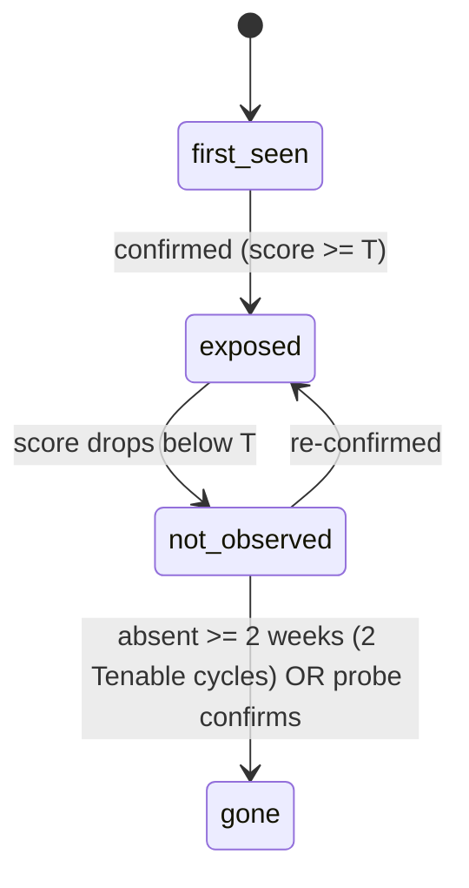
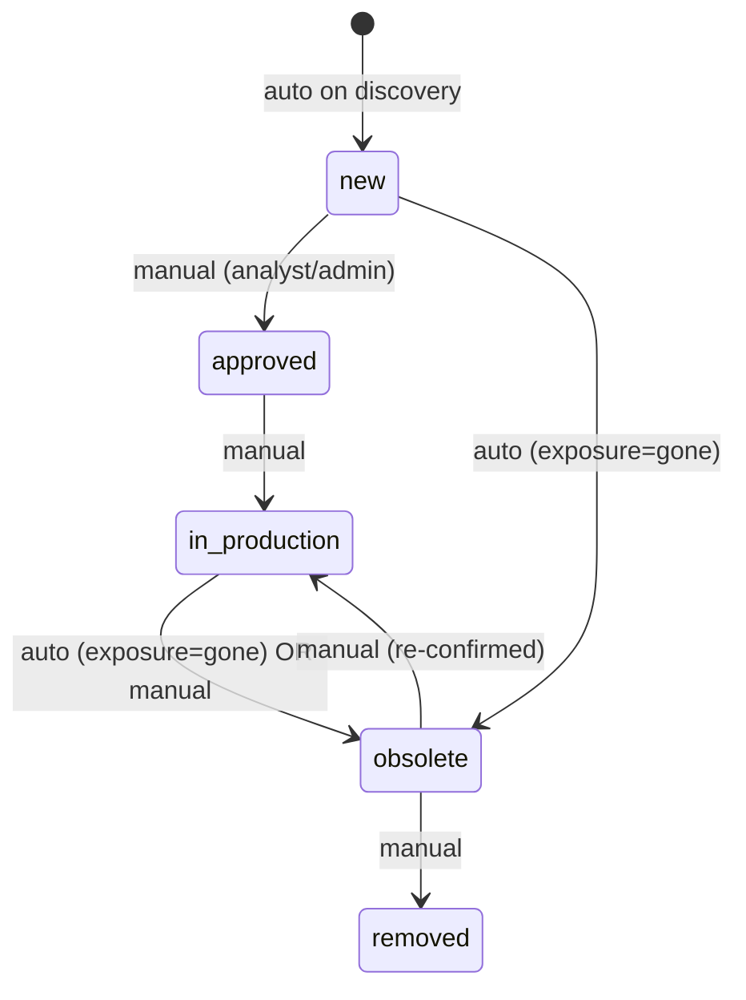

# External Attack Surface Management (EASM) Tool — Design Specification

**Status:** Design phase (no code yet)
**Purpose:** Discover, attribute, govern, and monitor the organisation's Internet-exposed services by ingesting multiple external/internal data sources, tracking each service across a lifecycle, and alerting on exposure changes.
**Audience:** This document is self-contained so the design can be continued in a separate Claude session within the same project.

---

## 1. Problem statement

Build a surface-exposure management platform that:

- Identifies Internet-published services (a **service** = a host with an open TCP/UDP port) belonging to the organisation, **and** tracks DNS names with nothing behind them (decommissioned or under-construction).
- Discovers **additional** candidate services beyond the known authoritative inventory.
- Assigns services to Organisational Units (OUs).
- Tracks each service across a lifecycle: `new → approved → in-production → obsolete → removed`.
- Provides SOC dashboards and weekly delta reports with trends, viewable in the UI.
- Sends alerts (email, Telegram, webhook) when services appear or disappear.
- Supports multiple users with RBAC: **admin** (settings), **analyst** (triage/view), **manager** (read-only overview).

---

## 2. Environment & constraints (decisions log)

These are fixed constraints agreed during design. A future session should treat them as given unless the user revises them.

| # | Constraint / Decision | Rationale / Notes |
|---|---|---|
| C1 | Authoritative inventory of owned ASNs/CIDRs/domains exists | Seeds discovery and attribution. Tool must also find *extra* services. |
| C2 | OU assignment is **manual** | No auto OU mapping in v1. |
| C3 | Alert triggers = service **appears** or **disappears** | Not tied to full lifecycle; only exposure transitions. |
| C4 | Auto-obsolete allowed | Keyed on source absence across cycles (see §7). |
| C5 | Active subscriptions: Shodan (**basic tier**), Tenable (licensed for **all** owned IPs), Shadowserver (API), dnsdumpster (API) | Shodan basic **cannot** monitor ~3,100 IPs → Shodan is supplementary, not a monitor. Tenable is the backbone. |
| C6 | Auth: **standalone local accounts** first; OIDC/SAML on roadmap | Build an auth seam so IdP drops in later. |
| C7 | Deployment: **local Proxmox VM**, Internet-facing | Single-VM docker-compose; hardened ingress. |
| C8 | Scale: 68 apex domains; ~250 services; ranges = 1×/21, 4×/24, 2×/27 (~3,100 IPs) | Small → single Postgres, no OpenSearch needed. |
| C9 | **Ingest-mainly**; active Internet probing only on trigger | nmap probe runs on admin request, or auto only in the "doubt" band if the admin enables that toggle (default off). |
| C10 | Tenable scan cadence = **weekly** | Drives auto-obsolete cycle math and system heartbeat. |
| C11 | Weighted confidence model; Tenable highest weight; probe breaks ties | See §6. |
| C12 | Weekly trend snapshots default; **daily snapshots = admin toggle** | Trends require periodic snapshot table. |
| C13 | Per-service: store **service type** + analyst **annotations** | Free-text notes, many per service. |
| C14 | Confirm threshold **T = 7** | Tenable(5)+one external(≥2) confirms; Tenable-alone → doubt band. |

**Roadmap ingestion sources (not v1, but architecture must accommodate):**
- **ELSA** (CCN-CERT / DELTA90) — national-level ASM feed identifying Internet-accessible services; external scanner, scans from source port 42104. Slots in as a weighted **pull** exposure feed (default weight 3).
- **SOCRadar.io** — EASM / threat-intel platform with REST API. Slots in as a weighted **pull** feed (default weight 2).

---

## 3. Source integration model

Sources differ fundamentally in access model, so they are **not** interchangeable connectors.

| Source | Access model | Cadence | Coverage | Role | Weight |
|---|---|---|---|---|---|
| **Tenable.io** | Export API (assets + vulns) | Weekly | All owned IPs (licensed) | **Authoritative anchor** | 5 |
| **Shadowserver** | Reports API; requires verified ownership of ASN/CIDR/domain; daily CSV/JSON; only your own space | Daily | Owned space, common accessible-service report types | Owned-space corroboration | 3 |
| **Shodan (basic)** | Search API poll (basic tier); Monitor/webhook **not viable** at ~3,100 IPs | Low-volume poll | Partial external | Supplementary external view | 2 |
| **dnsdumpster** | Official API `api.dnsdumpster.com`, `X-API-Key`; low limits (50/day free, 200/day Plus) | Enrichment pull | DNS records, subdomains, ASN, netblocks | **DNS discovery** (finds off-range/cloud candidates) | 1 |
| **ELSA** *(future)* | External ASM feed / API | Periodic pull | Owned assets | Corroboration | 3 |
| **SOCRadar** *(future)* | REST API | Periodic pull | External intel | Corroboration | 2 |
| **nmap probe** | Active, on-trigger only | On demand / doubt | Single target service | Tie-breaker / direct evidence | 4 |

**Notes**
- Shodan Monitor *does* support push webhooks with triggers (`new_service`, etc.), but the basic tier's monitored-IP cap makes it unusable as the primary monitor for this estate. Kept as poll enrichment.
- Shadowserver only returns data for networks you've verified ownership of; it is reliable but limited to its report repertoire and standard ports.
- dnsdumpster's low rate limits make it a periodic enumeration source, not a monitor.

---

## 4. High-level architecture

**Runtime components (docker-compose on one Proxmox VM):**
- Reverse proxy (Caddy/nginx) with TLS — public ingress.
- FastAPI app (REST API + auth) — also hosts an optional Shodan webhook receiver (unused at basic tier but wired).
- PostgreSQL (relational + JSONB for raw payloads).
- Redis (queue + Celery broker).
- Celery worker + beat (scheduled pulls, correlation, reporting, snapshots).
- Probe worker (nmap, isolated, rate-limited).
- React SPA (SOC UI).

---

## 5. Core data model

Model DNS names and services as **separate first-class entities** so a name with nothing behind it is representable.

### Entities & key fields

**source** — connector registry
`id, name, kind{push|pull_rest|pull_report|probe}, weight, cadence, enabled, config_ref`

**org_unit** — hierarchy
`id, name, parent_id`

**ownership_seed** — defines "ours" + attribution scope
`id, type{ASN|CIDR|Domain}, value, org_unit_id`

**host**
`id, ip, asn, netblock, first_seen, last_seen`

**dns_name** — no linked live service ⇒ decommissioned / under-construction
`id, fqdn, records(jsonb), resolves_to_host_id?, first_seen, last_seen`

**service** — identity key `(ip, port, protocol)`
`id, host_id, port, protocol{tcp|udp}, service_type, tls_info(jsonb), confidence_score, exposure_state{first_seen|exposed|not_observed|gone}, lifecycle_status{new|approved|in_production|obsolete|removed}, attribution{owned|candidate}, org_unit_id?, first_seen, last_seen`

**observation** — weighted evidence trail (provenance)
`id, source_id, entity_type{service|dns_name|host}, entity_id, asserts_present(bool), raw_payload(jsonb), observed_at`

**annotation** — analyst free-text notes (many per service)
`id, service_id, author_user_id, body, created_at`

**lifecycle_history** — audit of lifecycle transitions
`id, service_id, from_status, to_status, reason{manual|auto_obsolete|...}, actor_user_id?, changed_at`

**exposure_event** — appear/disappear (drives alerts)
`id, service_id, type{appeared|disappeared}, confidence_score, created_at`

**snapshot_metric** — trend series (weekly default; daily if enabled)
`id, taken_at, granularity{weekly|daily}, org_unit_id?, metric_name, metric_value`

**alert_rule / alert_channel / alert_delivery**
- rule: `id, event_type, org_unit_scope?, channel_id, dedup_window, throttle`
- channel: `id, kind{email|telegram|webhook}, config(jsonb), enabled`
- delivery: `id, rule_id, event_ref, status, sent_at, error?`

**user / role / audit_log**
- user: `id, username, password_hash, role_id, enabled`
- role: `id, name{admin|analyst|manager}, permissions(jsonb)`
- audit_log: `id, actor_user_id, action, target, before, after, at`

### Attribution logic
On discovery, attribute a service to the org if its IP ∈ an owned CIDR, its IP's ASN is owned, or (for DNS-derived) its FQDN is under an owned apex ⇒ `attribution = owned`. Otherwise `attribution = candidate` (unattributed; requires analyst review before it counts). OU assignment is always **manual** (C2).

---

## 6. Confidence model

Every source emits `observation.asserts_present`. The **confidence engine** aggregates weighted evidence into `service.confidence_score`.

**Weights:** Tenable 5, Shadowserver 3, ELSA 3, Shodan 2, SOCRadar 2, dnsdumpster 1, nmap probe 4.

**Threshold `T = 7`:**
- `score ≥ 7` ⇒ **confirmed** (fires `appeared` on first confirmation).
- Tenable alone (5) ⇒ **doubt band** (below T, single-source).
- Tenable(5) + any external(≥2) ⇒ confirmed.

**Doubt band handling:**
- Sources disagree, or single-source assertion below T.
- **Coverage-gap flag:** externals assert present but Tenable missed it ⇒ asset likely not in Tenable scan scope. Surface to admin (actionable — Tenable can fail per C5/C10).
- **Probe (optional):** small nmap check on that specific service to break the tie. Triggers: (a) admin-requested anytime; (b) auto-on-doubt **only if** admin enabled the toggle (default **off**, per ingest-mainly C9). Always rate-limited and audit-logged. Probe adds weight 4.

---

## 7. Lifecycle & exposure state machines

Two **separate** state dimensions per service.

### Exposure state (machine-driven)

### Lifecycle status (governance)

**Auto-obsolete (cadence-aware, C10):** service → `obsolete` when confidence stays below T for **≥2 weeks** (covers 2 weekly Tenable scans). Daily sources (Shadowserver / ELSA-if-daily) can corroborate a disappearance sooner; an admin probe confirms immediately. This prevents a single missed weekly scan from retiring a live service.

---

## 8. Alerting

**Triggers (C3):** `exposure_event.appeared` and `exposure_event.disappeared` only. Lifecycle transitions are recorded but do not alert (except that auto-obsolete is *caused by* a disappear event).

**Routing:** per-rule mapping of event type + OU scope → channel(s). Channels: email (SMTP), Telegram bot, generic webhook.

**Noise control:** dedup window + throttle per rule so a flapping host cannot spam. `appeared` only fires on the **first confirmed** sighting (score ≥ T), not on raw single-source observation.

---

## 9. RBAC

| Capability | admin | analyst | manager |
|---|---|---|---|
| View dashboards / reports | ✓ | ✓ | ✓ |
| Triage services, set lifecycle transitions, add annotations | ✓ | ✓ | — |
| Trigger nmap probe | ✓ | — | — |
| Manage sources, seeds, weights, alert rules/channels | ✓ | — | — |
| Manage users/roles, toggles (daily snapshot, auto-probe) | ✓ | — | — |

Enforced at API layer; every mutation writes `audit_log`. Auth is local JWT with an abstraction seam for future OIDC/SAML (C6).

---

## 10. Dashboards & reporting

**Live dashboard:** services by exposure state; by OU; owned vs candidate; lifecycle distribution; recent appear/disappear; DNS names with nothing behind them; coverage-gap flags.

**Weekly report (in-UI):** scheduled job computes delta vs prior week (new, disappeared, lifecycle transitions), stored as a report record, rendered in UI (not just emailed).

**Trends:** read from `snapshot_metric` — surface size over time, new/removed per week, per-OU growth. Weekly granularity default; daily optional (C12).

---

## 11. Deployment & hardening (Proxmox, single VM)

- docker-compose: proxy, api, postgres, redis, celery-worker, celery-beat, probe-worker, ui.
- **Ingress:** TLS via reverse proxy; restrict admin UI/API exposure as feasible.
- **Shodan webhook:** if ever enabled, verify `SHODAN-SIGNATURE-SHA1` HMAC and IP-allowlist the Shodan source at the proxy.
- **Secrets:** all source API keys in a secrets store / vault, never in repo or plain env.
- **Probe isolation:** nmap worker rate-limited, scoped to explicit targets, fully audited.
- **Backups:** Postgres dump schedule (holds sensitive exposure data + keys refs).
- **Data retention:** define retention for raw `observation` payloads vs derived state (see open items).

---

## 12. Build order

1. **Foundation** — data model, ownership seeds, manual OU assignment, RBAC (3 roles), local auth.
2. **Ingestion** — Shadowserver puller + Tenable export (authoritative owned-space) first; then Shodan poll + dnsdumpster enum.
3. **Correlation + confidence + lifecycle** — entity resolution, weighted scoring (T=7), exposure & lifecycle state machines, auto-obsolete.
4. **Discovery expansion** — dnsdumpster subdomain enum → resolve → off-range candidate flagging.
5. **Alerting** — appear/disappear → email/Telegram/webhook with dedup/throttle.
6. **SOC UI + weekly report + trends + snapshots.**
7. **Probe service** — admin-triggered nmap + optional doubt-band auto-probe.
8. **Roadmap connectors** — ELSA, SOCRadar (drop-in via connector interface); OIDC auth.

---

## 13. Open items to resolve before/during build

- Default confidence threshold `T = 7` **[agreed]**; per-source weights **[defaults agreed, tunable]**.
- Exact "absent ≥ 2 weeks" tuning per protocol (UDP likely longer; passive sources under-report UDP).
- Retention policy: how long to keep raw `observation` payloads vs derived state.
- Telegram bot ownership / webhook signing scheme for outbound alerts.
- dnsdumpster Plus vs free (200 vs 50/day) given 68 apexes — enumeration scheduling.
- Whether candidate (off-range) services should ever be auto-probed (default: no).

---

## 14. Tech stack summary

Python-first: **FastAPI**, **PostgreSQL** (JSONB), **Celery + Redis**, **React** UI, **nmap** (probe), local **JWT** auth (OIDC-ready), **Caddy/nginx** TLS ingress, docker-compose on Proxmox.
